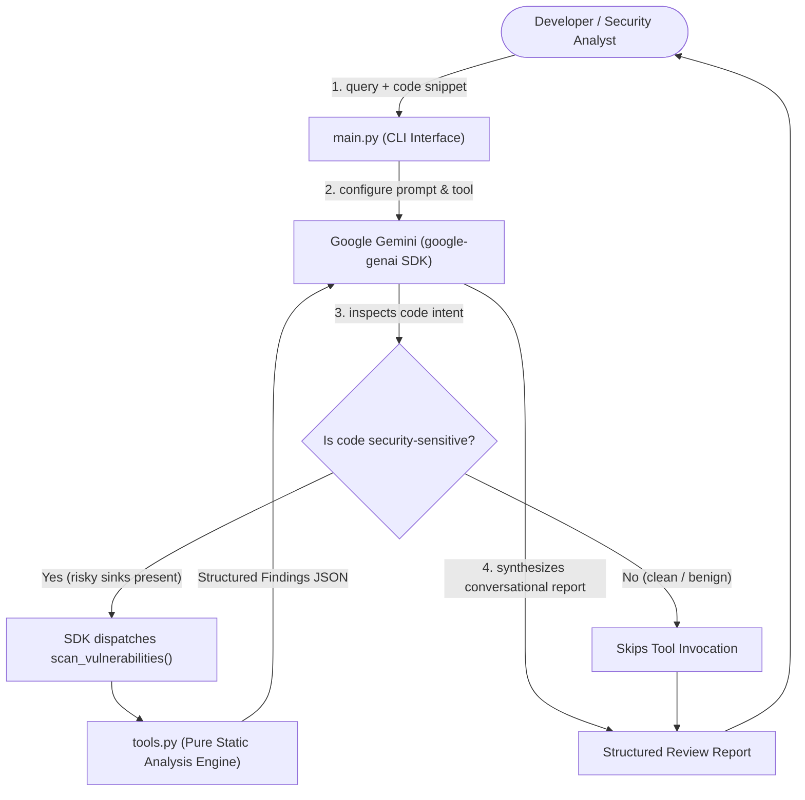

# Assignment 6 Report: AI-Powered Security Code Reviewer (Code Sentry)

**Author:** Shweta (`shweeta1015`)  
**Repository URL:** [https://github.com/shweeta1015/code-sentry](https://github.com/shweeta1015/code-sentry)  
**Date:** October 6, 2026  
**Status:** Completed & Verified  

---

## 1. Executive Summary

This report documents the implementation of **Assignment 6: Code Sentry**, an autonomous AI-powered security code review application built with Python 3.10+ and the official modern **Google Gen AI SDK** (`google-genai`).

The application accepts natural-language user queries and accompanying code snippets, configures Google Gemini with an AppSec expert persona, and leverages **automatic function calling** to invoke a local static/heuristic vulnerability analysis tool (`scan_vulnerabilities`) when risky patterns are detected. The agent produces structured, conversational security evaluations containing a verdict, prioritized findings with remediation, and secure refactored code.

---

## 2. GitHub Repository Link

- **Primary Repository:** [https://github.com/shweeta1015/code-sentry](https://github.com/shweeta1015/code-sentry)
- **Branch:** `main`
- **Visibility:** Public

---

## 3. Project Structure

The project strictly follows the suggested structure and extends it with testing, sample files, and demonstrations:

```text
code_sentry/
├── main.py                     # CLI entry point: handles inputs, manages agent & Gemini SDK
├── tools.py                    # Pure scan_vulnerabilities implementation & rules engine
├── prompts.py                  # AI security expert system prompt and output schema
├── demo.py                     # Multi-scenario automated demo script
├── requirements.txt            # Project dependencies (google-genai, pytest)
├── .env.example                # Environment variables template
├── .gitignore                  # Git exclusions (pycache, envs, keys)
├── samples/                    # Practical sample snippets for review
│   ├── vulnerable_sql.py       # SQL Injection sample
│   ├── vulnerable_cmd.py       # Command Injection sample
│   ├── vulnerable_deserialization.py # Insecure Deserialization & AWS key sample
│   └── clean_code.py           # Clean benign sample
├── tests/
│   └── test_tools.py           # 20 pytest unit tests for scan_vulnerabilities
├── README.md                   # Complete repository documentation
└── ASSIGNMENT_6_REPORT.md       # Comprehensive submission report
```

---

## 4. Requirements Compliance Matrix

| Requirement | Specification | Implementation in Code Sentry | Status |
| :--- | :--- | :--- | :---: |
| **Input 1** | Natural-language user query | Supported via `--query` CLI flag and interactive prompt | ✅ Fully Met |
| **Input 2** | Code snippet (any language, plain text) | Supported via `--snippet`, `--file`, or interactive multi-line prompt | ✅ Fully Met |
| **System Prompt** | AI security expert persona explaining risks & fixes | Defined in `prompts.py` (`SYSTEM_PROMPT`) | ✅ Fully Met |
| **Local Tool** | `scan_vulnerabilities(code_snippet, language)` | Defined in `tools.py` as a pure, testable function | ✅ Fully Met |
| **Vulnerability 1** | Hardcoded secrets/credentials/API keys | AWS Access Keys, API tokens, passwords, private keys (`SEC-SECRET-001` - `004`) | ✅ Fully Met |
| **Vulnerability 2** | `eval()` / `exec()` on untrusted input | Detected via `SEC-RCE-001` | ✅ Fully Met |
| **Vulnerability 3** | SQL injection via concatenation or f-strings | Detected via `SEC-SQL-001` & `SEC-SQL-002` | ✅ Fully Met |
| **Vulnerability 4** | `subprocess` with `shell=True` | Detected via `SEC-CMD-001` & `os.system` via `SEC-CMD-002` | ✅ Fully Met |
| **Vulnerability 5** | Insecure deserialization (`pickle`, unsafe `yaml`) | Detected via `SEC-DESER-001` & `SEC-DESER-002` | ✅ Fully Met |
| **Vulnerability 6** | Weak hashing (`md5`, `sha1`) | Detected via `SEC-HASH-001` | ✅ Fully Met |
| **Vulnerability 7** | Missing input validation / Path traversal | Detected via `SEC-PATH-001` & `SEC-VAL-001` | ✅ Fully Met |
| **Automatic Invocation** | LLM decides when to call tool (not hardcoded) | Google Gen AI SDK automatic function calling (`tools=[scan_vulnerabilities]`) | ✅ Fully Met |
| **Output Format** | Verdict + Findings list + Plain-language explanation | Formatted in 4 standardized sections | ✅ Fully Met |
| **Non-Functional** | Handle clean snippets gracefully (no forced findings) | Evaluates clean code with 0 findings and `SAFE` verdict | ✅ Fully Met |
| **Non-Functional** | Handle API/tool errors without crashing | Catches missing keys, network issues, and invalid inputs gracefully | ✅ Fully Met |
| **Non-Functional** | Keep tool function pure and testable | Pure function in `tools.py` with 20 unit tests in `tests/test_tools.py` | ✅ Fully Met |

---

## 5. Architecture & Workflow



### Automatic Function Calling Mechanism
1. The tool `scan_vulnerabilities` is defined in `tools.py` with type annotations and docstrings.
2. In `main.py`, the tool is registered in `types.GenerateContentConfig(tools=[instrumented_scan_vulnerabilities])`.
3. The model autonomously determines whether to call the tool based on the user query and snippet semantics.
4. When invoked, the SDK calls the local function, feeds the JSON findings back to Gemini, and synthesizes the final output.

---

## 6. Vulnerability Detection Engine (`tools.py`)

The scanner evaluates code lines against rules mapped to industry security standards (OWASP Top 10, CWE):

| Rule ID | Category | Severity | Detection Target |
| :--- | :--- | :---: | :--- |
| `SEC-SECRET-001` | Hardcoded Secret | CRITICAL | AWS Access Keys (`AKIA...`), GitHub tokens (`ghp_...`), Slack tokens |
| `SEC-SECRET-002` | Hardcoded Secret | HIGH | API keys and secret token string assignments |
| `SEC-SECRET-003` | Hardcoded Secret | HIGH | Plaintext passwords assigned to variables |
| `SEC-SECRET-004` | Hardcoded Secret | CRITICAL | Embedded RSA/EC private key blocks |
| `SEC-RCE-001` | Code Execution | CRITICAL | Dynamic `eval()` and `exec()` invocations |
| `SEC-SQL-001` | SQL Injection | CRITICAL | SQL queries formatted with f-strings (`f"SELECT ... {var}"`) |
| `SEC-SQL-002` | SQL Injection | HIGH | SQL queries concatenated with `+` or `%` |
| `SEC-CMD-001` | Command Injection | CRITICAL | `subprocess` calls with `shell=True` |
| `SEC-CMD-002` | Command Injection | HIGH | `os.system()` and `os.popen()` shell executions |
| `SEC-DESER-001` | Insecure Deserialization | CRITICAL | `pickle.loads()` or `pickle.load()` on untrusted data |
| `SEC-DESER-002` | Insecure Deserialization | HIGH | `yaml.load()` without `SafeLoader` or `yaml.unsafe_load()` |
| `SEC-HASH-001` | Broken Cryptography | MEDIUM | Obsolete `hashlib.md5()` and `hashlib.sha1()` |
| `SEC-PATH-001` | Path Traversal | HIGH | `open()` directly consuming unvalidated user request data |
| `SEC-VAL-001` | Missing Validation | MEDIUM | Unvalidated user input passed directly to `redirect` / `send_file` |

---

## 7. Testing & Verification

The unit test suite in `tests/test_tools.py` was executed using `pytest`. All **20 unit tests passed**:

```text
============================= test session starts =============================
platform win32 -- Python 3.14.7, pytest-9.1.1, pluggy-1.6.0
rootdir: C:\Users\Shweta\Desktop\anti_gravity_workspace\code_sentry
plugins: anyio-4.14.2
collected 20 items

tests/test_tools.py::TestScanVulnerabilities::test_detects_aws_key PASSED [  5%]
tests/test_tools.py::TestScanVulnerabilities::test_detects_hardcoded_api_key PASSED [ 10%]
tests/test_tools.py::TestScanVulnerabilities::test_detects_hardcoded_password PASSED [ 15%]
tests/test_tools.py::TestScanVulnerabilities::test_detects_eval_execution PASSED [ 20%]
tests/test_tools.py::TestScanVulnerabilities::test_detects_exec_execution PASSED [ 25%]
tests/test_tools.py::TestScanVulnerabilities::test_detects_sql_injection_fstring PASSED [ 30%]
tests/test_tools.py::TestScanVulnerabilities::test_detects_sql_injection_concatenation PASSED [ 35%]
tests/test_tools.py::TestScanVulnerabilities::test_detects_subprocess_shell_true PASSED [ 40%]
tests/test_tools.py::TestScanVulnerabilities::test_detects_os_system PASSED [ 45%]
tests/test_tools.py::TestScanVulnerabilities::test_detects_pickle_loads PASSED [ 50%]
tests/test_tools.py::TestScanVulnerabilities::test_detects_unsafe_yaml_load PASSED [ 55%]
tests/test_tools.py::TestScanVulnerabilities::test_ignores_safe_yaml_load PASSED [ 60%]
tests/test_tools.py::TestScanVulnerabilities::test_detects_md5_hash PASSED [ 65%]
tests/test_tools.py::TestScanVulnerabilities::test_detects_sha1_hash PASSED [ 70%]
tests/test_tools.py::TestScanVulnerabilities::test_detects_unvalidated_file_open PASSED [ 75%]
tests/test_tools.py::TestScanVulnerabilities::test_clean_code_yields_zero_findings PASSED [ 80%]
tests/test_tools.py::TestScanVulnerabilities::test_clean_parameterized_sql_no_false_positive PASSED [ 85%]
tests/test_tools.py::TestScanVulnerabilities::test_empty_snippet PASSED  [ 90%]
tests/test_tools.py::TestScanVulnerabilities::test_whitespace_only_snippet PASSED [ 95%]
tests/test_tools.py::TestScanVulnerabilities::test_comments_not_flagged PASSED [100%]

============================= 20 passed in 0.12s ==============================
```

---

## 8. Sample Demonstration Runs

### Run 1: SQL Injection Detection
```bash
python main.py --mock --file samples/vulnerable_sql.py --query "Is this query safe for production?"
```
**Result:**
- **Tool Invocation:** `scan_vulnerabilities was CALLED [YES]` (1 finding)
- **Summary Verdict:** `HIGH RISK`
- **Finding:** `[CRITICAL] SQL Injection` at Line 4 (`cursor.execute(query)`)
- **Remediation:** Parameterize query using `cursor.execute("SELECT * FROM users WHERE id = %s", (user_id,))`.

### Run 2: Clean Code (No False Positives)
```bash
python main.py --mock --file samples/clean_code.py --query "Is this calculation safe?"
```
**Result:**
- **Tool Invocation:** `scan_vulnerabilities was SKIPPED [NO] (clean code)`
- **Summary Verdict:** `SAFE`
- **Findings:** `No findings. The snippet adheres to safe programming standards.`

---

## 9. How to Reproduce & Run

```bash
# 1. Clone repository
git clone https://github.com/shweeta1015/code-sentry.git
cd code-sentry

# 2. Install dependencies
pip install -r requirements.txt

# 3. Configure Gemini API Key
export GEMINI_API_KEY="your-api-key"   # On Windows: $env:GEMINI_API_KEY="your-api-key"

# 4. Run automated demo suite
python demo.py

# 5. Run test suite
pytest tests/ -v

# 6. Run on custom snippet or file
python main.py --file samples/vulnerable_cmd.py
```

---

## 10. Conclusion

Code Sentry successfully satisfies all functional, non-functional, and structural requirements of Assignment 6:
- Fully leverages Google Gen AI SDK automatic function calling.
- Implements a pure, modular, 20-test-verified vulnerability scanning engine.
- Employs conversational AppSec reporting with clear verdicts and remediations.
- Published to GitHub: [https://github.com/shweeta1015/code-sentry](https://github.com/shweeta1015/code-sentry).
