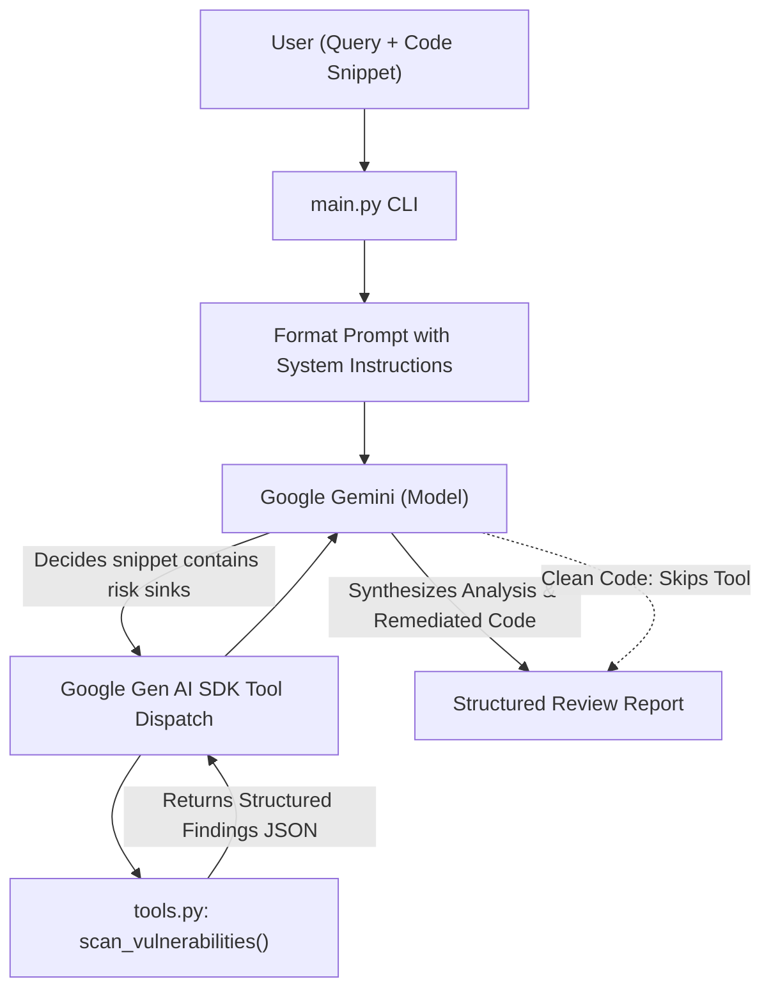

# Code Sentry: AI-Powered Security Code Reviewer

[](https://www.python.org/downloads/)
[](https://github.com/googleapis/python-genai)
[](tests/test_tools.py)
[]()

**Code Sentry** is an autonomous AI-powered security code review application built with Python and the modern **Google Gen AI SDK** (`google-genai`). It accepts developer queries and source code snippets, empowers Google Gemini with an elite AppSec system prompt, and leverages **automatic function calling** to invoke a local static/heuristic vulnerability analysis tool (`scan_vulnerabilities`) whenever risky code patterns are detected.

---

## 🌟 Key Features

1. **Autonomous Tool Calling**: Gemini dynamically evaluates the snippet and query, deciding whether to invoke the local `scan_vulnerabilities` tool without hardcoded application branching.
2. **Comprehensive Vulnerability Detection**:
   - 🔑 **Hardcoded Secrets & API Keys**: AWS Access Keys, generic API tokens, embedded passwords, private key certificates.
   - ⚡ **Arbitrary Code Execution**: Unsafe use of `eval()`, `exec()`, and dynamic code interpretation.
   - 💉 **SQL Injection**: Queries constructed with dynamic f-strings, concatenation (`+`), or string format specifiers.
   - 💻 **Command Injection**: Subprocess execution with `shell=True`, `os.system()`, and `os.popen()`.
   - 📦 **Insecure Deserialization**: Python `pickle.loads()`, `yaml.load()` without `SafeLoader`, and `yaml.unsafe_load()`.
   - 🔒 **Broken Cryptographic Hashing**: Deprecated MD5 and SHA-1 algorithms used for sensitive contexts.
   - 📂 **Path Traversal & Missing Validation**: Unsanitized user inputs passed directly into file operations (`open()`).
3. **Structured & Developer-Friendly Reporting**:
   - **Summary Verdict**: Clear status (`SAFE`, `NEEDS ATTENTION`, `HIGH RISK`).
   - **Detailed Findings**: Severity level, offending line number, original line snippet, plain-English risk explanation, and targeted remediation steps.
   - **Production-Ready Remediated Code**: Secure replacement implementations.
4. **Robust & Pure Tool Architecture**:
   - The `scan_vulnerabilities` tool is pure, modular, and testable independently of the LLM.
   - Edge cases (empty code snippets, comments, whitespace) are handled gracefully without false positives.
   - Includes a deterministic `--mock` mode for offline execution, evaluation, and CI/CD testing.

---

## 📁 Project Structure

```text
code_sentry/
├── main.py                  # CLI entry point: handles inputs, manages agent & Gemini SDK
├── tools.py                 # Pure scan_vulnerabilities function & security rules engine
├── prompts.py               # AI security expert system instructions & response schema
├── demo.py                  # Multi-scenario automated demo script
├── requirements.txt         # Project dependencies (google-genai, pytest)
├── .env.example             # Template for API credentials
├── .gitignore               # Ignored files (pycache, pytest, venvs, keys)
├── samples/                 # Test sample files
│   ├── vulnerable_sql.py    # SQL injection sample
│   ├── vulnerable_cmd.py    # Command injection sample
│   ├── vulnerable_deserialization.py # Pickle + Secret sample
│   └── clean_code.py        # Safe benign snippet
├── tests/
│   └── test_tools.py        # 20 comprehensive unit tests for scan_vulnerabilities
└── README.md                # Documentation and report
```

---

## 🚀 Getting Started

### 1. Prerequisites
- Python **3.10+** (Tested on Python 3.10 - 3.14)
- A **Gemini API Key** from [Google AI Studio](https://aistudio.google.com/)

### 2. Installation

Clone the repository and install dependencies:

```bash
git clone https://github.com/shweeta1015/code-sentry.git
cd code-sentry
pip install -r requirements.txt
```

### 3. Environment Configuration

Set your Gemini API key in your terminal session or a `.env` file:

**Linux / macOS:**
```bash
export GEMINI_API_KEY="your-gemini-api-key"
```

**Windows PowerShell:**
```powershell
$env:GEMINI_API_KEY = "your-gemini-api-key"
```

**Windows Command Prompt:**
```cmd
set GEMINI_API_KEY=your-gemini-api-key
```

---

## 💻 Usage & CLI Guide

Code Sentry provides an intuitive command-line interface supporting direct arguments, file inputs, offline mock mode, and interactive sessions.

### 1. Review a Code File
```bash
python main.py --file samples/vulnerable_sql.py --query "Is this function safe for production?"
```

### 2. Review an Inline Snippet
```bash
python main.py --snippet "def run(x): return eval(x)" --query "Can I deploy this?"
```

### 3. Offline / Mock Mode (No API Key Required)
Use the `--mock` flag to evaluate code review workflows and verify tool invocation offline:
```bash
python main.py --mock --file samples/vulnerable_cmd.py
```

### 4. Interactive Mode
Launch an interactive code review console:
```bash
python main.py --interactive
```

### 5. Custom Gemini Model Selection
By default, Code Sentry uses `gemini-2.5-flash`. You can specify alternative models:
```bash
python main.py --file samples/clean_code.py --model gemini-2.0-flash
```

---

## 🤖 Automatic Tool Invocation Architecture

The application uses Google Gen AI SDK's native function calling (`tools=[instrumented_scan_vulnerabilities]`).



1. **System Prompt Configuration (`prompts.py`)**: Defines the AI as an AppSec engineer with instructions on when to call `scan_vulnerabilities` and how to format responses.
2. **Schema Registration**: The Gen AI SDK inspects `tools.py` type hints and docstrings to register the tool schema with the model.
3. **Execution**:
   - On **risky snippets** (e.g., dynamic queries, deserialization, command execution), Gemini invokes `scan_vulnerabilities` and uses the returned findings to produce an in-depth security report.
   - On **clean snippets** (e.g., pure math calculations, simple strings), Gemini skips tool invocation and returns a `SAFE` verdict without false alarms.

---

## 🧪 Testing & Verification

Code Sentry includes a comprehensive test suite of **20 unit tests** covering all vulnerability patterns and edge cases:

Run tests with `pytest`:
```bash
pytest tests/ -v
```

### Test Coverage Summary:
- ✅ AWS access keys & token regex detection (`SEC-SECRET-001`)
- ✅ Hardcoded API keys and tokens (`SEC-SECRET-002`)
- ✅ Plaintext passwords in code (`SEC-SECRET-003`)
- ✅ Arbitrary code execution via `eval()` and `exec()` (`SEC-RCE-001`)
- ✅ SQL Injection via f-strings (`SEC-SQL-001`)
- ✅ SQL Injection via string concatenation (`SEC-SQL-002`)
- ✅ Command injection via `subprocess(shell=True)` (`SEC-CMD-001`)
- ✅ Shell execution via `os.system()` (`SEC-CMD-002`)
- ✅ Insecure deserialization via `pickle.loads()` (`SEC-DESER-001`)
- ✅ Insecure deserialization via unsafe `yaml.load()` (`SEC-DESER-002`)
- ✅ Safe YAML loads (`Loader=SafeLoader`) correctly excluded
- ✅ Deprecated cryptographic hashing with MD5 & SHA1 (`SEC-HASH-001`)
- ✅ Path traversal & unvalidated file input (`SEC-PATH-001`)
- ✅ Safe code correctly verified with 0 findings and `SAFE` verdict
- ✅ Safe parameterized SQL queries not falsely flagged
- ✅ Empty snippet edge case handling
- ✅ Whitespace-only edge case handling
- ✅ Comments containing rule keywords correctly ignored

---

## 🎬 Automated Demonstration

Run the automated demo to see Code Sentry in action across 4 distinct scenarios:

```bash
python demo.py
```

### Sample Output (Scenario 1: SQL Injection):
```text
================================================================================
[*] CODE SENTRY - AI SECURITY CODE REVIEWER
================================================================================
[*] User Query: Is this authentication query safe to use in our production login endpoint?
[*] Language  : python
[*] Mode      : Mock / Offline
--------------------------------------------------------------------------------
[*] Code Snippet to Review:
    1 | def authenticate_user(username, password):
    2 |     # Retrieve user from PostgreSQL database
    3 |     query = f"SELECT * FROM users WHERE username = '{username}' AND password_hash = '{password}'"
    4 |     cursor.execute(query)
    5 |     return cursor.fetchone()
--------------------------------------------------------------------------------
[*] Running security analysis...

================================================================================
[*] SECURITY REVIEW REPORT
================================================================================
[*] Tool Invocation: scan_vulnerabilities was CALLED [YES]
    -> Tool reported: 1 finding(s)
--------------------------------------------------------------------------------
## 1. Summary Verdict
**HIGH RISK**: Potentially critical security vulnerabilities were discovered during the security assessment. This code should NOT be deployed to production in its current form.

## 2. Findings & Risk Analysis
### Finding #1: [CRITICAL] SQL Injection
- **Line Reference**: Line 4 (`cursor.execute(query)`)
- **Plain-Language Explanation**: SQL query dynamically formatted using an f-string. This exposes the database to severe SQL injection vulnerabilities.
- **Recommended Fix**: Use parameterized queries with placeholder syntax (e.g., cursor.execute('SELECT * FROM users WHERE id = %s', (user_id,))).

## 3. Remediated Code
```python
def authenticate_user(username, password_hash):
    query = "SELECT id, username, email FROM users WHERE username = %s AND password_hash = %s"
    cursor.execute(query, (username, password_hash))
    return cursor.fetchone()
```

## 4. Key Takeaways
- Always separate SQL statements from user data using parameterized queries.
- Never concatenate raw or f-string user input into database queries.
================================================================================
```

---

## 📐 Assumptions & Design Decisions

1. **Language Scope**: While the prompt accepts any language, rules are prioritized for Python and general polyglot patterns (SQL, Shell, AWS keys, API tokens).
2. **Deterministic Fallback**: To ensure reproducibility across offline test environments and automatic CI pipelines without requiring active paid API tokens, a `--mock` execution mode is built-in.
3. **Safety & Zero Side-Effects**: The `scan_vulnerabilities` tool is strictly static and read-only. It never executes or unpickles analyzed code.
4. **Resilience & UTF-8 Encoding**: Configured to work cross-platform across Windows PowerShell, Linux, and macOS without character set encoding issues.
